# Báo cáo Lab 4 - Weather App

**Sinh viên:** Lê Viết Thắng  
**Tên dự án:** `flutter_weather_app_LeVietThang`  
**API sử dụng:** OpenWeatherMap

## 1. Mục tiêu

Trong lab này, em xây dựng ứng dụng thời tiết bằng Flutter có tích hợp API thật, xử lý bất đồng bộ, parse JSON, quản lý trạng thái, lấy vị trí, cache offline, tìm kiếm thành phố và giao diện thay đổi theo điều kiện thời tiết.

## 2. Chức năng đã hoàn thành

- Em đã hiển thị thời tiết hiện tại gồm nhiệt độ, cảm giác như, mô tả, icon, thành phố, quốc gia và thời gian cập nhật.
- Em đã hiển thị chi tiết: độ ẩm, tốc độ gió, áp suất, tầm nhìn, mây, mặt trời mọc/lặn, nhiệt độ thấp/cao.
- Em đã hiển thị dự báo 24 giờ tới và dự báo 5 ngày.
- Em đã làm chức năng tìm kiếm thời tiết theo tên thành phố.
- Em đã lưu lịch sử tìm kiếm và danh sách thành phố yêu thích.
- Em đã lấy thời tiết theo vị trí hiện tại bằng GPS.
- Em đã cache dữ liệu thời tiết gần nhất bằng `shared_preferences`.
- Em đã hiển thị dữ liệu cache khi offline hoặc API lỗi.
- Em đã hỗ trợ pull-to-refresh.
- Em đã xử lý loading state và error state.
- Em đã thêm cài đặt đổi đơn vị °C/°F.
- Em đã xây dựng giao diện động theo thời tiết nắng, mưa, nhiều mây và ban đêm.

## 3. Thiết kế giao diện

Em cập nhật giao diện theo yêu cầu trong file Lab 4:

- Card bo góc 20px.
- Padding màn hình 16-20px.
- Màu sắc thay đổi theo điều kiện thời tiết:
  - Sunny: vàng `#FDB813`, xanh trời `#87CEEB`.
  - Rainy: xám đậm `#4A5568`, xám `#718096`.
  - Cloudy: xám sáng `#A0AEC0`, `#CBD5E0`.
  - Night: nền tối `#1A202C`, `#2D3748`.
- Sử dụng icon từ OpenWeatherMap và icon Material.
- Em thiết kế riêng các trạng thái loading/error để dễ hiểu cho người dùng.

## 4. Cấu trúc chính

```text
lib/
  config/api_config.dart
  models/weather_model.dart
  models/forecast_model.dart
  providers/weather_provider.dart
  screens/home_screen.dart
  screens/search_screen.dart
  screens/forecast_screen.dart
  screens/settings_screen.dart
  services/weather_service.dart
  services/location_service.dart
  services/storage_service.dart
  utils/weather_theme.dart
  widgets/
```

## 5. Hướng dẫn cấu hình API

Em mở file `.env.example` và điền API key OpenWeatherMap:

```env
OPENWEATHER_API_KEY=your_actual_api_key_here
```

Em không upload API key thật lên GitHub. Khi nộp bài, em chỉ giữ file `.env.example`.

## 6. Hướng dẫn chạy

```bash
flutter pub get
flutter run
```

Kiểm tra code:

```bash
flutter analyze
flutter test
```

## 7. Ảnh minh họa

### 7.1. Màn hình chính


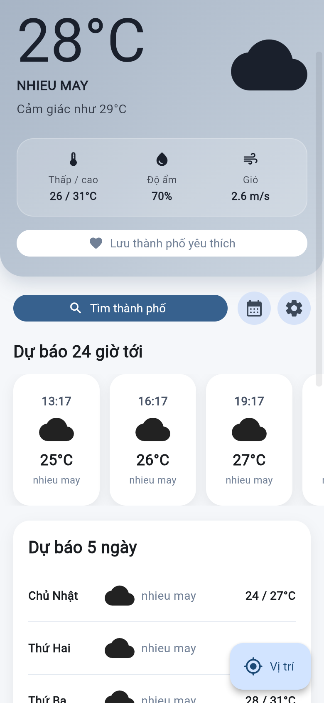

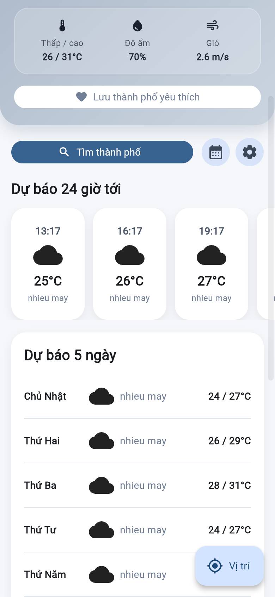

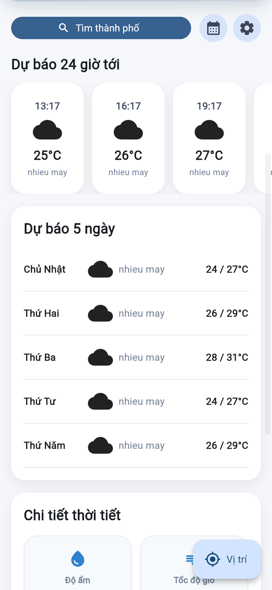

### 7.2. Tìm kiếm và dự báo

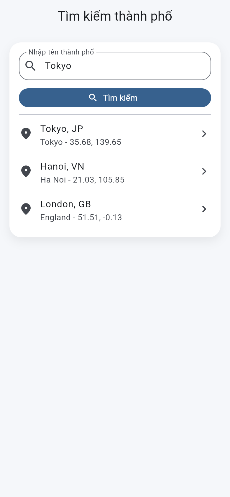

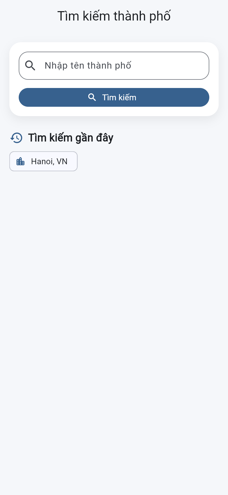

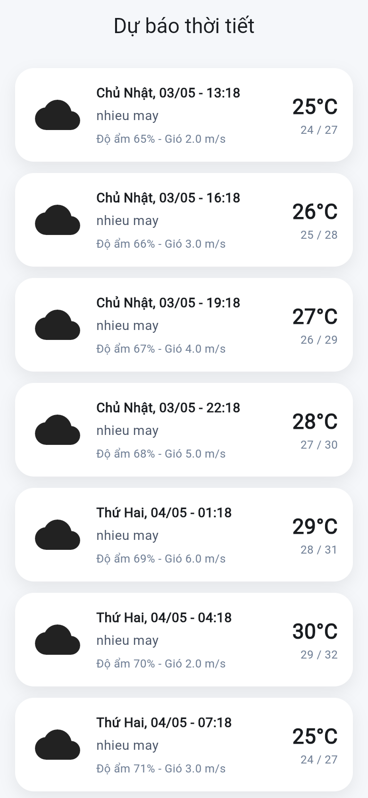

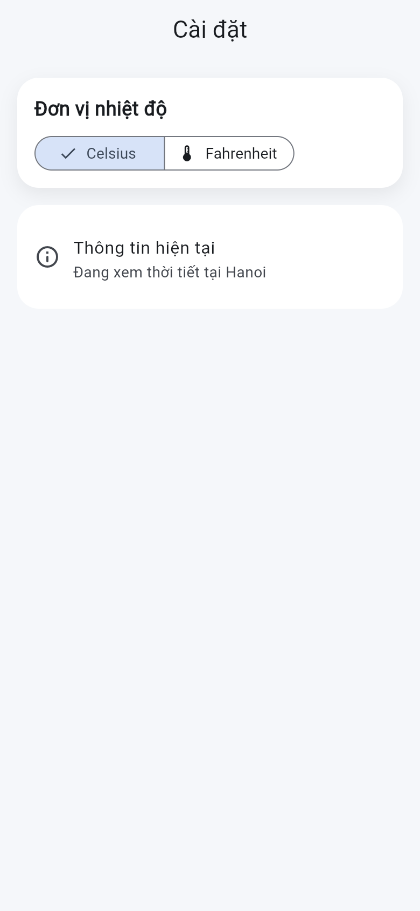

### 7.3. Trạng thái ứng dụng


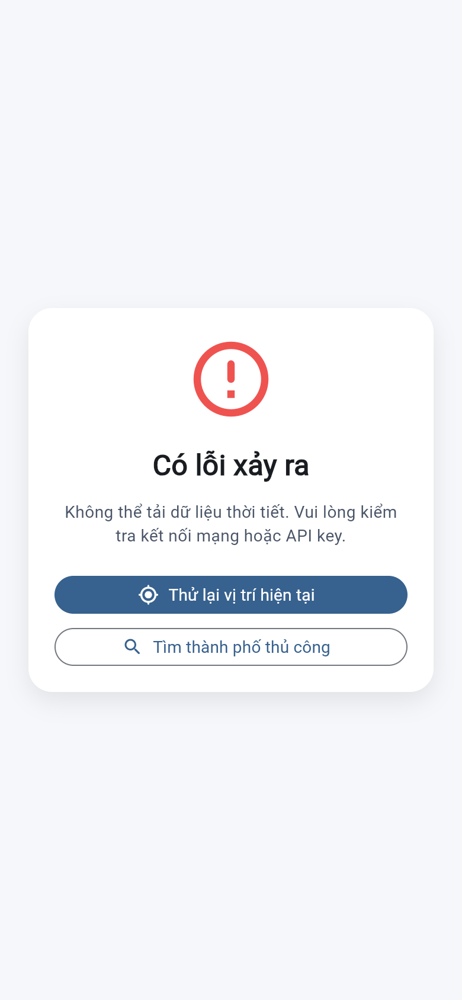

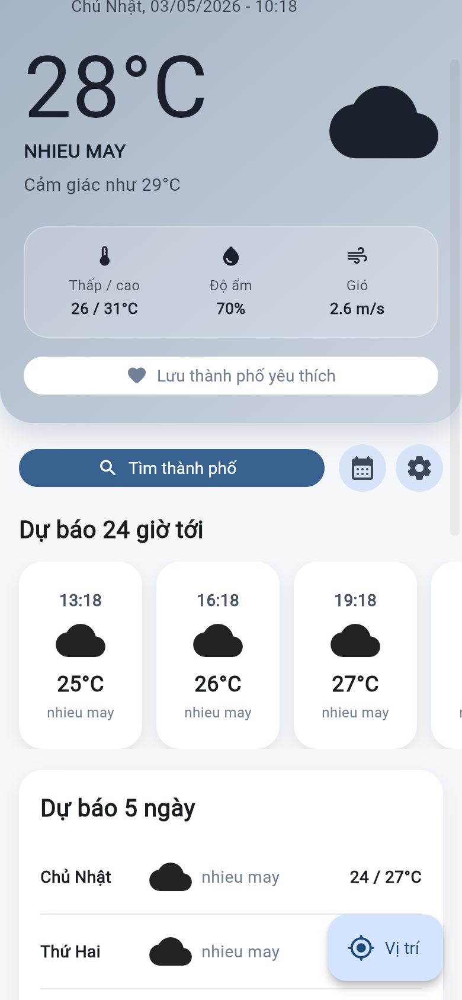

### 7.4. Giao diện theo thời tiết

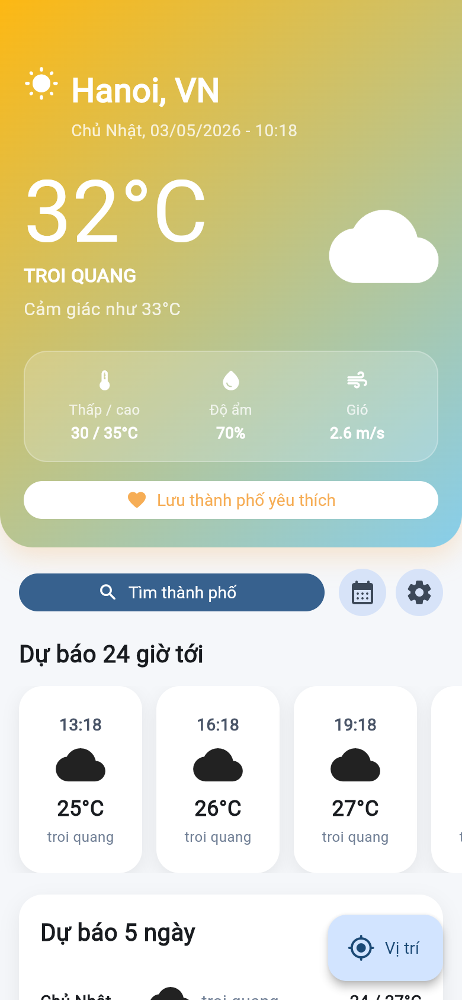

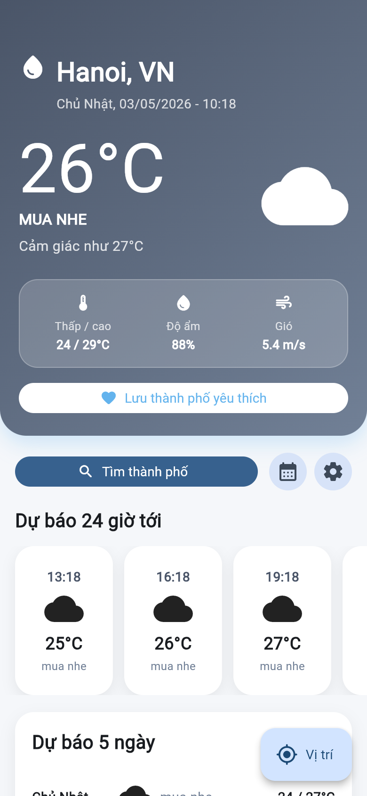

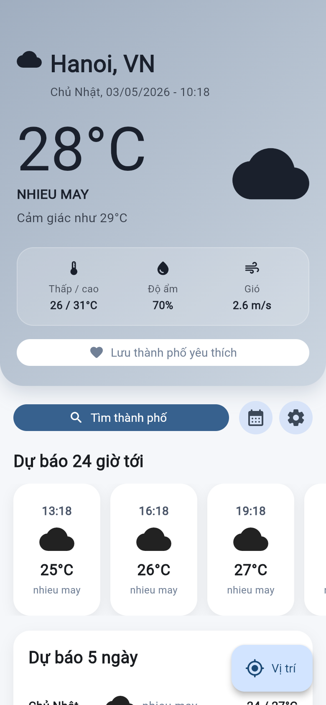

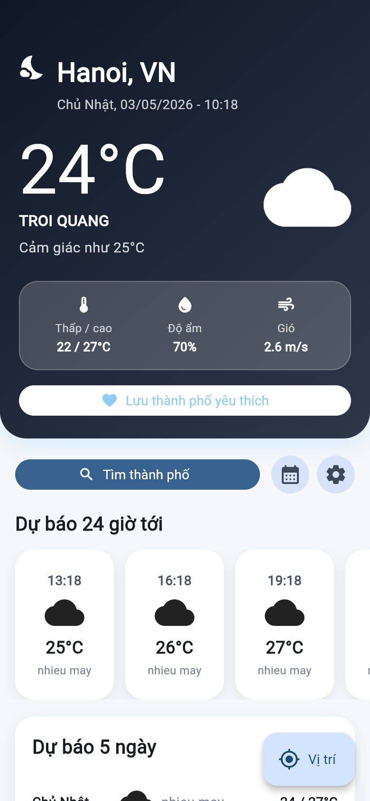

## 8. Kết quả kiểm thử thủ công

- Em nhập thành phố hợp lệ: ứng dụng tải thời tiết và forecast thành công.
- Em nhập thành phố không tồn tại: ứng dụng hiển thị lỗi.
- Em không nhập từ khóa tìm kiếm: ứng dụng nhắc nhập tên thành phố.
- Em kéo để làm mới: ứng dụng gọi lại API.
- Em tắt mạng hoặc mô phỏng lỗi API: ứng dụng hiển thị dữ liệu cache nếu đã có.
- Em đổi °C/°F: nhiệt độ trên các màn hình được cập nhật.

## 9. Hạn chế và hướng phát triển

- Ứng dụng của em chưa có AQI, bản đồ thời tiết và thông báo cảnh báo thời tiết.
- Em có thể bổ sung nhiều API dự phòng để giảm lỗi khi OpenWeatherMap giới hạn lượt gọi.
- Em có thể thêm đa ngôn ngữ và widget thời tiết ngoài màn hình chính.
